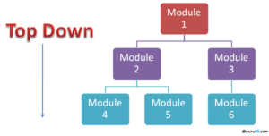
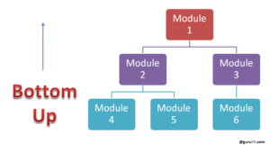
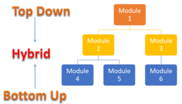
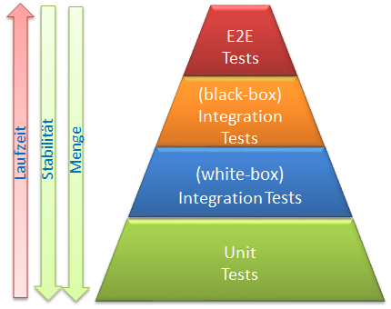

# Different types of tests

## Unit Test

### Was ist ein Unit Test

Unit-Test, auch Modultest oder Komponententest, ist ein Softwareentwicklungs­prozess, bei dem die kleinsten prüfbaren Teile oder Einheiten einer Anwendung, die so genannten Units, einzeln und unabhängig voneinander auf ihren ord­nungsgemäßen Betrieb hin untersucht werden.

Diese Testmethodik wird während des Entwicklungsprozesses von den Softwa­reentwicklern und manchmal auch von Mitarbeitern der Qualitätssicherung (Quality Assurance, QA) durchgeführt. Das Hauptziel von Unit-Tests besteht dar­in, den zu testenden Code zu isolieren und festzustellen, ob er wie beabsichtigt funktioniert.
Unit-Tests sind ein wichtiger Schritt im Entwicklungsprozess, denn wenn sie kor­rekt durchgeführt werden, können sie dazu beitragen, frühzeitig Fehler im Code aufzudecken, die in späteren Testphasen möglicherweise schwieriger zu finden sind.
Unit Testing ist ein Bereich der testgetriebenen Entwicklung (Test-driven Deve­lopment, TDD), einer Methodik, die einen sorgfältigen Ansatz zur Erstellung ei­nes Produkts durch kontinuierliches Testen und Überarbeiten verfolgt. Diese Testmethode ist auch die erste Stufe des Softwaretestens, die vor anderen Test­methoden wie Integrationstests durchgeführt wird. Unit-Tests werden typischer­weise isoliert gemacht, um sicherzustellen, dass sich eine Unit nicht auf exter­nen Code oder Funktionen stützt. Das Testen kann manuell durchgeführt wer­den, ist aber oft automatisiert.

### Wie funktioniert ein Unit Test

Ein Unit-Test besteht typischerweise aus drei Stufen: Planung, Testfälle und Skripting sowie dem Unit-Test selbst. Im ersten Schritt wird der Unit-Test vorbe­reitet und überprüft. Im nächsten Schritt werden die Testfälle und Skripte er­stellt, dann wird der Code getestet.
Die testgetriebene Entwicklung erfordert, dass Entwickler zunächst fehlgeschla­gene Unit-Tests schreiben. Dann schreiben sie Code und refaktori­sieren die Anwendung, bis der Test bestanden ist. TDD führt in der Regel zu ei­ner expliziten und vorhersehbaren Codebasis.
Jeder Testfall wird unabhängig in einer isolierten Umgebung getestet, um si­cherzustellen, dass keine Abhängigkeiten im Code bestehen. Der Softwareent­wickler sollte Kriterien zur Verifizierung jedes Testfalls codieren, und ein Test-Framework kann verwendet werden, um alle fehlgeschlagenen Tests zu mel­den. Entwickler sollten nicht jede Codezeile testen, da dies zu viel Zeit in Anspruch nimmt. Die Entwickler sollten Tests erstellen, die sich auf Code konzentrieren, der das Verhalten der zu entwickelnden Software beeinflussen könnte.
Unit-Tests umfassen nur solche Merkmale, die für die Leistung der zu testenden Unit entscheidend sind. Dies ermutigt die Entwickler, den Quellcode zu modifizieren, ohne sich unmittelbar Gedanken darüber machen zu müssen, wie sich solche Änderungen auf das Funktionieren anderer Einheiten oder des Programms als Ganzes auswirken könnten.
Nachdem festgestellt wurde, dass alle Units in einem Programm so effizient und fehlerfrei wie möglich arbeiten, können größere Komponenten des Programms mit Unterstützung von Integrationstests evaluiert werden. Unit-Tests sollten häufig erfolgen. Sie lassen sich manuell oder automatisiert ausführen.

### Vor- und Nachteile von Unit Tests

Zu den Vorteilen von Unit Tests gehören:

- Je früher ein Problem erkannt wird, desto weniger zusammengesetzte Fehler treten auf.
- Die Kosten für die frühzeitige Behebung eines Problems können die Kosten für die spätere Behebung schnell aufwiegen.
- Debugging-Prozesse werden erleichtert.
- Entwickler können schnell Änderungen an der Codebasis vornehmen.
- Entwickler können auch Code wiederverwenden und ihn in neue Projekte migrieren.

Zu den Nachteilen gehören:

- Tests decken nicht jeden Fehler auf.
- Unit-Tests testen nur Datensätze und deren Funktionalität – es werden keine Fehler bei der Integration entdeckt.
- Möglicherweise müssen mehr Zeilen Testcode geschrieben werden, um eine Zeile Code zu testen – was eine potenzielle Zeitinvestition darstellt.
- Unit-Tests können eine steile Lernkurve haben, da man zum Beispiel lernen muss, wie man bestimmte automatisierte Tools benutzt.

## Integration Test

### Was sind Integrationstests?

Der in der Softwareentwicklung sehr verbreitete Begriff „Integrationstests“ kann intuitiv interpretiert werden. Er bezeichnet solche Tests, die überprüfen, ob mehrere (oft getrennt entwickelte) Bestandteile des Gesamtsystems rei­bungslos und fehlerfrei miteinander zusammenspielen. Es wird dabei das Ziel verfolgt, die Schnittstellenfehler bei der Zusammenarbeit von mehreren Sub­systemen bzw. Applikationsbereichen untereinander rechtzeitig zu erkennen. Außerdem wird geprüft, ob die unterschiedlichen Module eines Systems so funktionierten wie erwartet. Diese Art des Testens wird nach dem Unittest, der zuerst die Komponente einzeln und unabhängig voneinander testet, durchge­führt. Auf diese Weise werden Fehler entdeckt, die die Unittests nicht finden konnten. Nach den Integrationstests werden üblicherweise End-to-End Tests durchgeführt.

### Einsatzfelder

Integrationstests werden dann eingesetzt, wenn das reibungslose Zusammen­spiel zwischen den einzelnen Bestandteilen des Systems garantiert werden soll. Fehler bei der Integration können aufgrund mehrerer Faktoren auftreten, wie z.B. die Verwendung eines externen Systems, die abweichende Kommunikati­onsformate verwendet. In der Praxis finden sich sehr viele Sub-Arten von sol­chen Tests, die dann je nach Zielsetzung auf verschiedenen Granularitätsebe­nen angewendet werden können. Diese sind:

- Inner-Module Integration Tests
- Cross-Module Integration Tests
- Cross-Tier Integration Tests
- Sub-System Integration Tests
- System Integration Tests

### Strategien für Integrationstests

Auch gibt es mehrere Strategien bei der Umsetzung der Integrationstests, wie z.B. Top-Down und Bottom-Up Vorgehensweise. Nachfolgend findest du einen kurzen Überblick:

#### 1. Top-Down-Testing

Bei diesem Ansatz fängt man mit der Integration der Module auf den oberen Stufen, die hochgranulare Geschäftsmodule abbilden, an und erweitert diese Tests Schritt für Schritt bis hin zu Modulen auf den niedrigsten Stufen, die feingranulare Aspekte einer Applikation implementieren. Solange die Module auf untersten Ebenen nicht existieren, können sie durch die Verwendung von “Stubs” simu­liert werden.

Quelle: <https://www.guru99.com/integration-testing.html>

Vorteile

- Fokus auf die Integration der Kerngeschäftsabläufe statt auf die Details
- Ein Tester kann die Module nach Priorität testen und so größere Fehler in der Konstruktion schneller finden und melden
- Frühe Bereitstellung eines Prototyps möglich

Nachteile

- Die Module auf der niedrigen Stufe werden unzureichend getestet und möglicherweise werden die spezifischen Fehler dort zu spät entdeckt

#### 2. Bottom-Up-Testing

Bei diesem Ansatz werden zuerst die Module aus den niedrigsten Stufen bis hin zu den obersten Stufen getestet. Diese Methode ist empfehlenswert, wenn als Erstes sichergestellt werden sollte, dass die Basismodule möglichst reibungslos untereinander funktionieren. Die Ansteuerungslogik im Test ersetzt dabei die eventuell noch nicht fertiggestellte Geschäftslogik auf den höheren Stufen, weshalb der Testfall dann als ”Driver” für Module auf unteren Stufen fungiert.

Quelle: <https://www.guru99.com/integration-testing.html>

Vorteile

- Kleinere Code-Einheiten auf unteren Stufen können frühzeitig und unab­hängig von der Fertigstellung der “großen” Module umfangreich integra­tiv getestet werden
- Effizientere Aufteilung der Tests auf verschiedene Teams
- Schnelle Fehlerfindung

Nachteile

- Die Module auf der obersten Stufe werden unzureichend bzw. zu spät ge­testet, so dass trotz guter Integration auf niedrigen Stufen die wichtigen Schnittstellen auf den höheren Ebenen ungetestet bleiben

#### 3. Hybrid-Integrationstest

Neben diesen zwei Strategien existiert auch eine Mischung aus beiden – der Hybrid-Integrationstest. Hier werden obere und untere Module gleichzeitig inte­griert getestet. Dazu werden sowohl Stubs als auch Drivers eingesetzt.

Quelle: <https://www.guru99.com/integration-testing.html>

### Integrationstests vs. Unittests und funktionale End-To-End Tests

In jeder Testumgebung sind alle drei Arten des Testens sehr wichtig und schlie­ßen sich nicht gegenseitig aus. Der grundlegende Unterschied liegt in der hier­archischen Reihenfolge, nach der diese erfolgen sollten. Das bedeutet, dass wenn Integrationstests durchgeführt werden, müssen davor alle Unittests er­folgreich ausgeführt worden sein bzw. für die funktionalen End-to-End Tests ist das erfolgreiche Bestehen der Integrationstests notwendig. Der Hintergrund dieser Sequenz ist, dass bei Unittests der Code einzelner Komponenten sehr effektiv und zielgenau isoliert auf seine Richtigkeit und Anwendbarkeit geprüft wird. Damit wird die Basisfunktionalität dieser Komponenten sichergestellt. Im zweiten Schritt werden die unterschiedlichen Module miteinander vernetzt und somit wird die reibungslose Kommunikation zwischen diesen überprüft. Erst am Ende werden funktionale End-To-End Tests durchgeführt, die als eine Art von kundennahen Interaktionstests interpretiert werden können, die die übergrei­fenden Geschäftsabläufe gemäß den fachlichen Anforderungen funktional über­prüfen und deshalb erst ausgeführt werden sollen, wenn die einzelnen System­bestandteile richtig integriert sind. Auch die Komplexität der Tests und deren Ausführungsdauer steigt rapide in der dargestellten Reihenfolge. Zu einem er­folgreichen Testprozess gehören alles 3 Teststufen dazu, da sie miteinander kor­relieren und sich beim sorgfältigen Design optimal ergänzen.

